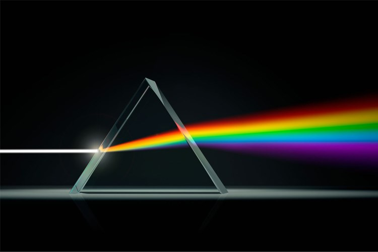

# 显示技术

本书的第一个专题将围绕简单图形绘制展开，我们将介绍如何在屏幕上画出我们想要的二维图形或图像。本专题所介绍的技术和方法，将成为渲染三维场景的基础。如同绘画需要先准备颜料和纸、笔，为了在屏幕上绘制图形，也必须先从显示技术讲起。

## 颜色空间

我们之所以能区分世间万物，依赖于不同的物体在不同的光照和远近下所产生的颜色上的不同，这也是为什么我们能在彩色相片中看出比黑白相片更多的细节。在进行图形绘制之前，我们必须调好我们的“色盘”——然而，颜色的种类是否是无限的？面对如此多种多样的颜色，我们又该如何表示、储存和显示它们呢？

### 颜色的本质

和照相机、摄像机等现代机械设备一样，我们的眼睛也是一个精密的光学仪器，如下图所示。物体发出的多条光线透过晶状体（可看成凸透镜）射入眼睛、在视网膜上成像，最终通过视神经的处理成为我们所看到的画面。

```{figure-md}


人眼的结构
```

由此可知，从物理上来说，人眼并不能接收“颜色”，只能接收光。由于广义的光线和电磁波是同义语，具体地，我们把人眼能接收并处理的电磁波称为**可见光（visible light）**。作为一种波动，可见光应当具有频率、波长、振幅等属性，其中前两者是标量、后者是矢量，它们均与人眼识别颜色的过程相关。

```{figure-md}


三棱镜分光实验
```

为了探究人眼“着色”的机理，我们不妨回顾一下经典的棱镜分光实验：太阳光在透过棱镜时会发生折射，由于不同波长的光线偏折角度不同，最终出射了赤橙黄绿青蓝紫的连续色谱。这一个简单的常识向我们透露了下列两条信息：

```{prf:observation}
1. 不同波长的可见光具有不同的颜色；

2. 一种颜色的光线（例如“白色”的日光）可能是由多种不同的可见光组合而成的。
```

光波中电场振幅的大小决定了光的强度，颜色与光强的定性关系可以从以下思维实验中得出：有两部显示相同画面的显示器，初始时二者对应位置的颜色完全一致，现在我们将一个显示器的亮度调到最高、另一个显示器的亮度调到最低，两台显示器的发光强度有了明显差别，与此同时，其对应位置的颜色也不再相同。一般而言，光强越低时颜色越暗，光强越高时颜色越明。

```{note}
这里我们只提到了光波的波长和振幅。作为频率与波长的乘积，光速在像人眼的玻璃体这样的固定介质中是一个常量，因此波长将唯一决定其频率。我们无法准确判断究竟是频率还是波长决定了我们的颜色感知。通常人们选取波长来考察，可见光的波长大约在 $400\,\text{nm}$ 到 $780\,\text{nm}$ 范围内。
```

在物理学 {cite}`feynman-lectures-1` 中，
